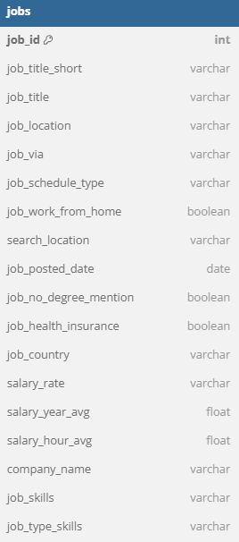
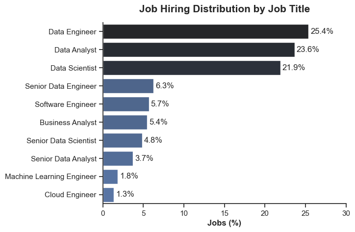
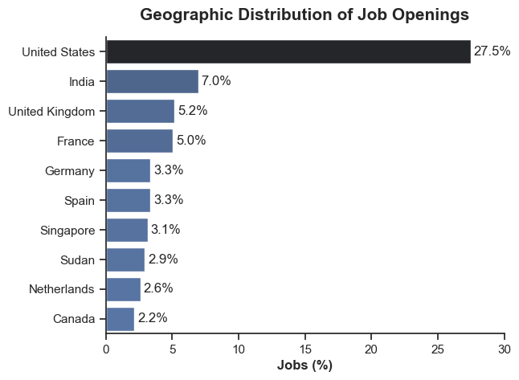
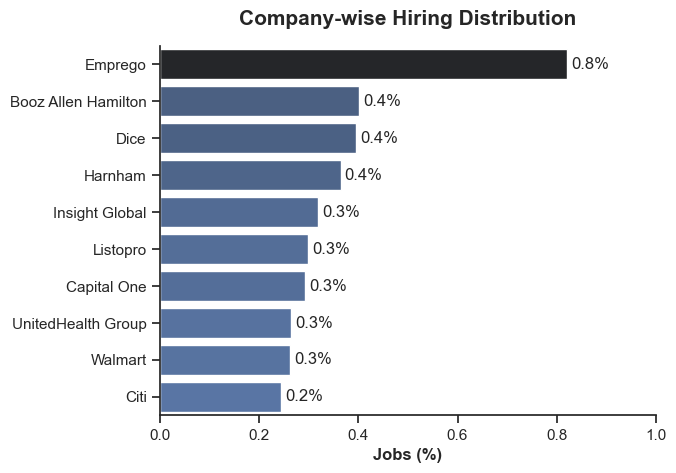
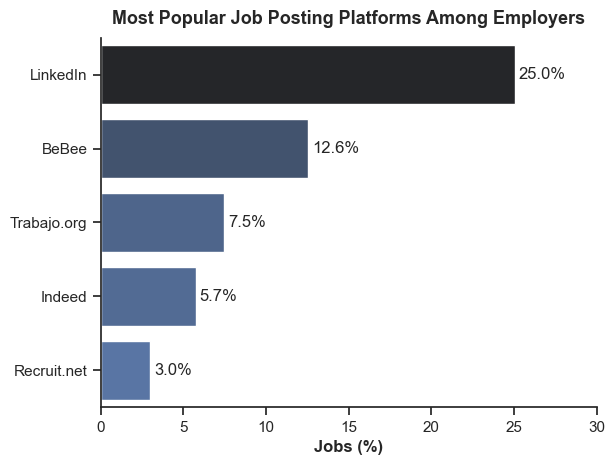
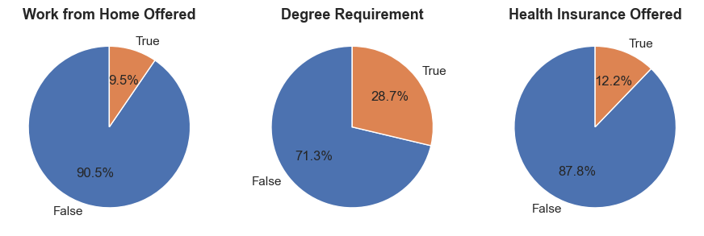
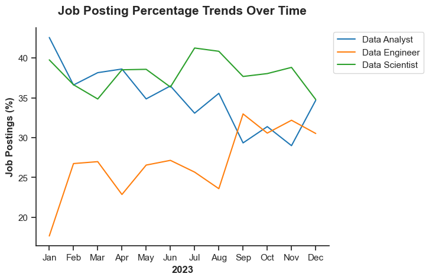
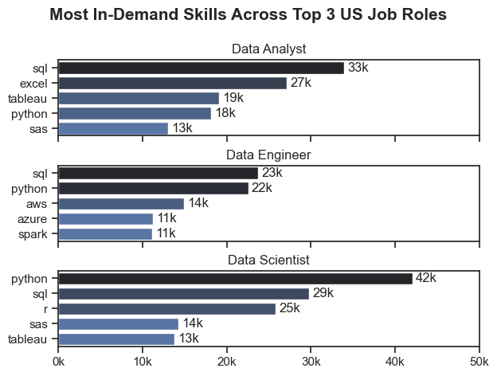

# Exploring Data Industry Job Trends

### **Table of Contents:**

- [Project Background](#project-background)
- [Data Structure](#data-overview)
- [Executive Summary](#executive-summary)
- [Insight Deep-Dive](#insight-deep-dive)
- [Recommendation](#recommendation)

# Project Background
Navigating career choices can be challenging, especially for college students preparing to enter the workforce. As a student pursuing a data-related career, I understand the importance of developing key skills early to stay competitive. This led me to ask: *Which skills should I focus on now to succeed in the future?*

This project serves both as a personal effort to enhance my skills and as a guide for other students looking to build a solid foundation in data-related fields. By identifying essential skills and gaining practical experience, aspiring data professionals can increase their confidence and readiness for job opportunities. Ultimately, this project aims to bridge the gap between academic learning and industry demands, helping students enter the workforce with relevant and in-demand skills.

# Data Overview
The [data_jobs](https://huggingface.co/datasets/lukebarousse/data_jobs) dataset was sourced from Data Analyst Luke Barousse. It contains job posting data collected through his website in 2023. The dataset consists of 786,000 rows and 17 columns.

# Executive Summary
This project explores the data-related job market by analyzing job listings to uncover important insights. It looks at how jobs are distributed across different locations, which companies are hiring the most, the skills they want, and the benefits they offer. While the job market is competitive, there are many opportunities for people who know in-demand skills like Excel, SQL, Python, Power BI, Tableau, and Cloud technologies. Using platforms like LinkedIn and staying updated with new trends can improve job seekers' chances. This project also highlights the importance of continuous learning and improving technical skills to succeed in both beginner and advanced roles in the fast-changing data industry.

# Insight Deep-Dive

### Job Hiring Distribution by Job Title

- Data Engineer (25.4%), Data Analyst (23.6%), and Data Scientist (21.9%) together account for over 70% of the total job distribution. In contrast, Senior Data Engineer, Senior Data Scientist, and Senior Data Analyst roles represent a significantly smaller share, suggesting that entry- and mid-level positions are more abundant. This indicates that companies are prioritizing hiring for foundational roles over advanced, specialized ones.

### Geographic Distribution of Job Openings

- The United States leads significantly, accounting for 27.5% of job openings—nearly four times more than India (7.0%), the second-highest. This suggests that the U.S. remains the largest market for job opportunities, likely due to its thriving tech industry, economic scale, and demand for skilled professionals.

- India (7.0%), United Kingdom (5.2%), and France (5.0%) are prominent secondary markets. This reflects growing globalization and the rise of regional tech ecosystems, especially in Asia and Europe.

### Company-wise Hiring Distribution

- Emprego leads with 0.8% of the total job distribution, twice the share of the next-largest companies. This suggests aggressive hiring or a large-scale recruitment drive, positioning Emprego as a key player in the job market.

- Booz Allen Hamilton, Dice, and Harnham each account for 0.4%, reflecting a competitive mid-tier hiring landscape. These companies are likely targeting specialized talent, given their consistent presence.

### Most Popular Job Posting Platforms Among Employers

- LinkedIn leads significantly with 25.0% of job postings, twice the share of the next platform (BeBee). This suggests LinkedIn is the go-to platform for employers due to its professional network and wide reach.

- BeBee holds 12.6% of job postings, establishing itself as a strong second. This indicates its popularity for industry-specific roles.

- Platforms like Trabajo.org (7.5%), Indeed (5.7%), and Recruit.net (3.0%) show moderate adoption, suggesting that employers distribute job postings across multiple channels to reach diverse talent pools.

### Percentage of Job Condition and Benefits

- Only 9.5% of job postings offer remote work, while 90.5% require on-site presence. This suggests that remote work options remain uncommon, indicating limited flexibility in work location.

-  28.7% of jobs require a degree, while 71.3% do not. This implies that employers prioritize skills and experience over formal educational qualifications.

- Just 12.2% of positions offer health insurance, while 87.8% do not provide this benefit. This suggests that employee benefits packages may be limited, possibly reflecting cost-cutting or contract-based roles.

### USA Job Market Trends in 2023

- Data Analyst and Data Scientist roles dominate the market consistently.

- Data Engineer postings increased sharply from August to October, suggesting growing technical needs.

- There is seasonal variability, especially for Data Analysts, implying changes in business needs across the year.

### Likelihood of Skills Requested in US Job Postings

- SQL and Python are the most in-demand across all three roles.

- Cloud skills (AWS, Azure) are critical for Data Engineers.

- Data Analysts benefit from combining Excel and Tableau with core technical skills.

- Advanced modeling and machine learning drive Data Scientist requirements.

*Check out the Python code used for data cleaning and manipulation [here](Exploratory_Data_Analysis.ipynb).*

# Recommendation
### **Strategic Recommendations for Job Seekers in Data Roles:**

1. **Focus on Core Skills First:** Prioritize learning SQL and Python while strengthening Excel for entry-level roles.

2. **Embrace Cloud Technologies:** Get hands-on with AWS or Azure—consider beginner certifications like AWS Certified Cloud Practitioner to boost credibility and to future-proof yourself.

3. **Enhance Data Visualization Capabilities:** Learn a visualization tool (Tableau or Power BI) to make your analysis more actionable, impactful, and easier to understand through clear storytelling.

4. **Develop Big Data and Automation Skills:** Explore PySpark for handling large datasets and Pandas for automation in small-to-medium projects.

5. **Target Companies with Strategic Approach:** Build a strong LinkedIn presence and actively apply on platforms like BeBee and Trabajo.org for emerging opportunities. Focus on data-heavy industries (finance, healthcare, and tech). 

6. **Adapt to Work Flexibility Trends:** Be open to hybrid or on-site roles for greater opportunities. Focus on building projects and a portfolio to showcase skills — experience outweighs formal education.

