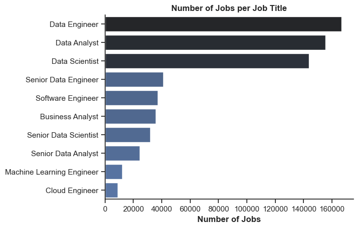
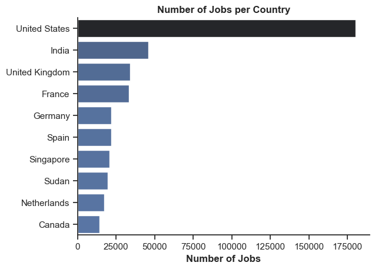
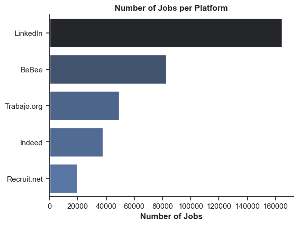
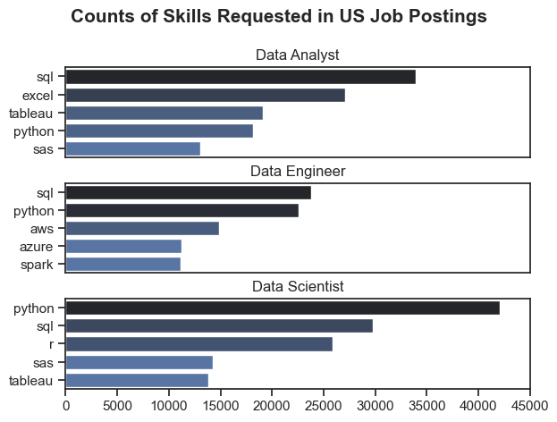
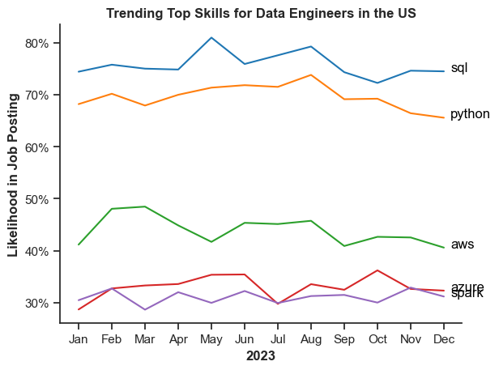

# Overview
This project explores the job market data to gain insights into hiring trends and essential skills while strengthening my expertise in Exploratory Data Analysis (EDA). Inspired by [Luke Barousse's Python Course](https://www.youtube.com/watch?v=wUSDVGivd-8&t=22916s), I expanded upon the original analysis by incorporating additional data quality checks and preprocessing techniques.

Key improvements include:

- Analyzing dataset structure, percentage, and count of null values
- Dropping columns with more than 60% null values
Removing rows with null values and duplicates to ensure data integrity
- By enhancing data cleaning and preprocessing techniques, this project deepened my understanding of job market patterns and improved my Python-based EDA skills.

# The Questions
Below are the questions I want to answer in my project:

1. Which job role has the highest number of job offers?
2. Which country has the highest number of job offers?
3. Which companies have posted the most job openings?
4. What is the most commonly used job posting platform?
5. What percentage of job postings offer work-from-home options, require a degree, or provide health insurance?
6. What are the most in-demand skills for the top three most popular data roles in the US?
7. What are the top trending skills for data engineers in the US?

# Data Preparation and Cleanup
I began by importing the necessary libraries and loading the dataset, then performed initial data cleaning tasks to ensure data quality.

```python
# importing libraries
import ast
import pandas as pd
import seaborn as sns
import matplotlib.pyplot as plt

# loading data 
dataset = load_dataset('lukebarousse/data_jobs')
df = dataset['train'].to_pandas()

# data cleaning
df = df.drop(columns=['salary_rate', 'salary_year_avg', 'salary_hour_avg'])
df = df.dropna()
df = df.drop_duplicates()
df['job_via'] = df['job_via'].str.replace(r'\s*via\s*', '', regex=True)
df['job_skills'] = df['job_skills'].apply(lambda x: ast.literal_eval(x))
df['job_posted_date'] = pd.to_datetime(df['job_posted_date'])

# saving cleaned dataset
df.to_csv("cleaned_data_jobs.csv", index=False)
```
# The Analysis
This section provides a comprehensive overview of the steps taken to address the stated questions, along with the corresponding results and key insights.

## 1. Which job role has the highest number of job offers?
To determine the job role with the highest number of job offers, I extracted the values from the `job_title_short` column and used `value_counts()` to count the job postings for each title. The results were then stored in a new DataFrame, `df_job_role`.

### Visualize Data

```python
df_job_role = df['job_title_short'].value_counts().to_frame()

sns.barplot(data=df_job_role, x='count', y='job_title_short', hue='count', palette='dark:b_r', legend=False)

plt.show()
```
### Results


*Bar graph displaying the job role with the highest number of job offers.*

### Insights:
- Data Engineer, Data Analyst, and Data Scientist dominate the job market, reflecting the increasing need for data professionals in various industries.

- Senior Data Engineer, Senior Data Scientist, and Senior Data Analyst have significantly fewer job offers than their junior counterparts. This suggests that entry and mid-level roles are more widely available compared to senior positions.

## 2. Which country has the highest number of job offers?
To identify the country with the highest number of job offers, I extracted the values from the `job_country` column and used `value_counts()` to count the job postings for each country. The top 10 results were then stored in a new DataFrame, `df_job_country`.

### Visualize Data

```python
df_job_country = df['job_country'].value_counts().to_frame().head(10)

sns.barplot(data=df_job_country, x='count', y='job_country', hue='count', palette='dark:b_r', legend=False)

plt.show()
```

### Results


*Bar graph showing the country with the highest number of job offers*

### Insights:
- The overwhelming number of jobs in the U.S. suggests a strong and diverse job market, possibly driven by a large economy, technological advancements, and a high concentration of multinational companies. This dominance may indicate greater employment opportunities but also higher competition.

## 3. Which companies have posted the most job openings?
To identify the companies with the most job openings, I extracted the values from the `company_name` column and used `value_counts()` to count the job postings for each company. The top 10 results were then stored in a new DataFrame, `df_companies`.

### Visualize Data

```python
df_companies = df['company_name'].value_counts().to_frame().head(10)

sns.barplot(data=df_companies, x='count', y='company_name', hue='count', palette='dark:b_r', legend=False)

plt.show()
```

### Results


*Bar graph showing the company with the highest number of job offers.*

### Insights:
- Emprego has the highest number of job postings, significantly more than other companies. This suggests that they are aggressively hiring or have a broader range of job openings.

- The companies listed span various industries, including finance (Citi, Capital One), healthcare (UnitedHealth Group), retail (Walmart), and consulting (Booz Allen Hamilton). This suggests that job opportunities exist across multiple sectors.

## 4. What is the most commonly used job posting platform?
To identify the most common job posting platform, I extracted the values from the `job_via` column and used `value_counts()` to count the job postings for each platform. The results were then stored in a new DataFrame, `df_platform`.

### Visualize Data
```python
df_platform = df['job_via'].value_counts().to_frame().head(5)

sns.barplot(data=df_platform, x='count', y='job_via', hue='count', palette='dark:b_r', legend=False)

plt.show()
```
### Results


*Bar graph showing the job posting platform with the highest number of job offers.*

### Inisghts:
- LinkedIn has the highest number of job postings, significantly outpacing all other platforms. This suggests that LinkedIn is a primary platform for job seekers and recruiters.

- While LinkedIn has the most jobs, other factors like industry focus, job quality, and user base may impact which platform is best for job seekers.

## 5. What percentage of job postings offer work-from-home options, require a degree, or provide health insurance?

I first created a dictionary, `dict_colum`n, to map column names to more readable titles. Then, I initialized a figure with three subplots using `plt.subplots()`, ensuring that each pie chart would be displayed side by side. I also used `autopct='%1.1f%%'` to display the percentages on the charts.

### Visualize Data
```python
dict_column = {
    'job_work_from_home': 'Work from Home Offered',
    'job_no_degree_mention': 'Degree Requirement',
    'job_health_insurance': 'Health Insurance Offered'
}

fig, ax = plt.subplots(1, 3, figsize=(11, 3.5))

for i, (column, title) in enumerate(dict_column.items()):
    ax[i].pie(df[column].value_counts(), labels=['False', 'True'], autopct='%1.1f%%', startangle=90)
    ax[i].set_title(title, weight='bold')

plt.show()
```
### Results


*Pie charts showing the distribution of job postings based on work-from-home availability, degree requirements, and health insurance offerings.*

### Insights:
- Only 9.5% of job postings offer work-from-home options, while the majority (90.5%) require employees to work on-site. This suggests that remote work opportunities are still relatively scarce in the dataset, which could be a consideration for job seekers looking for flexible work arrangements.

-  About 28.7% of job postings explicitly require a degree, whereas 71.3% do not mention a degree requirement. This indicates that many employers prioritize skills and experience over formal education, making it easier for non-degree holders to find job opportunities.

- Only 12.2% of job postings include health insurance as a benefit, while the majority (87.8%) do not. This highlights a potential gap in employee benefits, which could influence job seekers' decisions when evaluating job offers. 

## 6. What are the most in-demand skills for the top three most popular data roles in the US?
To identify the most in-demand skills for the top three most popular data roles, I first filtered the dataset to include only the most common positions. Then, I extracted the top five skills for each of these roles. This analysis highlights the most popular job titles and their key skills, helping me determine which skills to focus on based on my target role.


### Visualize Data

```python
fig, ax = plt.subplots(len(job_titles), 1)

for i, job_title in enumerate(job_titles):
    df_plot = df_skills_count[df_skills_count['job_title_short'] == job_title].head(5)[::-1]
    sns.barplot(data=df_plot, x='skill_count', y='job_skills', ax=ax[i], hue='skill_count', palette='dark:b_r')

plt.show()
```

### Results


*Bar graph visualizing the top 3 data roles and their top 5 skills associated with each.*

### Insights:
- SQL is the most in-demand skill for Data Analysts, Data Engineers, and Data Scientists. This confirms that structured data handling, querying databases, and managing relational databases are fundamental skills in data-related careers.

- Python is the most in-demand skill for Data Scientists and a crucial skill for Data Engineers. This suggests that Data Engineers and Data Scientists need strong coding skills, while Data Analysts can focus more on querying and visualization.

## 7. What are the top trending skills for data engineers in the US?
To analyze skill trends for Data Engineers in 2023, I filtered out Data Engineer positions and grouped the skills by the month of the job postings. This allowed me to identify the top five skills for Data Engineers each month, revealing how their popularity evolved throughout the year.

### Visualize Data

```python
from matplotlib.ticker import PercentFormatter

df_plot = df_DA_US_percent.iloc[:, :5]
sns.lineplot(data=df_plot, dashes=False, legend='full', palette='tab10')

plt.gca().yaxis.set_major_formatter(PercentFormatter(decimals=0))

plt.show()
```
### Results


*Bar graph visualizing the trending top skills for data engineer in the US in 2023.*

### Insights:
- SQL and Python are the most in-demand skills, consistently appearing in over 70% of job postings, making them essential for data engineers.

- AWS, Azure, and Spark are valuable but secondary skills, with AWS maintaining moderate demand (40–50%) and Azure/Spark showing steady but lower demand (~30–35%).

- It suggests that SQL and Python are fundamental skills for data engineers, making them essential for securing job opportunities. Meanwhile, AWS, Azure, and Spark serve as valuable but complementary skills, meaning proficiency in them can enhance job prospects but may not be mandatory for all roles.

# What I Learned
Throughout this project, I gained deeper insights into the data analyst job market while strengthening my technical skills in Python, particularly in data manipulation and visualization. Here are some key takeaways:

- By utilizing libraries such as Pandas for data manipulation, Seaborn and Matplotlib for data visualization, and additional tools for various analytical tasks, I significantly improved my ability to handle, analyze, and interpret complex datasets with greater efficiency and accuracy.

- I learned that thorough data cleaning and preparation are fundamental to any data analysis process, as they help eliminate inconsistencies, handle missing values, and enhance data quality. Ensuring clean and well-structured data is crucial for generating accurate, meaningful, and reliable insights.

- This project underscored the importance of aligning technical skills with industry demand. By analyzing the relationship between skill requirements, and job availability, I gained a clearer understanding of how to strategically position myself in the competitive tech landscape. This knowledge allows for more informed career planning, ensuring that my skill set remains relevant and valuable in the evolving job market.

# Conclusion
This deep dive into the data job market has provided valuable insights into the essential skills and emerging trends shaping the field. The knowledge gained not only enhances my understanding but also offers actionable guidance for professionals aiming to grow in data-related job. As the industry continues to evolve, ongoing analysis and skill development will be vital to staying competitive. This project serves as a strong foundation for further exploration, reinforcing the importance of continuous learning, adaptability, and data-driven decision-making in this ever-changing landscape.