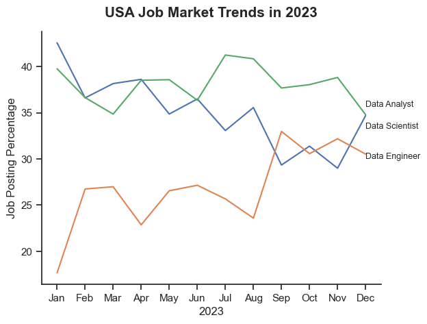

# Exploring Data Industry Job Trends

### **Table of Contents:**

- [Project Background](#project-background)
- [Data Overview](#data-overview)
- [Analytical Focus](#analytical-focus)
- [Data Preparation and Cleanup](#data-preparation-and-cleanup)
- [Insight Deep-Dive](#insight-deep-dive)
    - [Job Hiring Distribution by Job Title](#1-which-job-role-had-the-highest-percentage-of-job-postings)
    - [Geographic Distribution of Job Openings](#2-which-country-recorded-the-highest-number-of-job-openings)
    - [Company-wise Hiring Distribution](#3-which-companies-were-the-top-recruiters-based-on-job-postings)
    - [Most Popular Job Posting Platforms Among Employers](#4-which-job-posting-platform-is-used-the-most-by-employers)
    - [Percentage of Job Condition and Benefits](#5-what-percentage-of-job-postings-offer-work-from-home-options-require-a-degree-or-provide-health-insurance)
    - [USA Job Market Trends in 2023](#6-what-are-the-key-trends-and-patterns-in-job-postings-for-data-analyst-data-engineer-and-data-scientist-roles-over-time)
    - [Likelihood of Skills Requested in US Job Postings](#7-what-are-the-top-trending-skills-for-data-engineers-in-the-us)
- [Recommendation](#recommendation)
- [Conclusion](#conclusion)

# Project Background
Navigating career choices can be challenging, especially for college students preparing to enter the workforce. As a student pursuing a data-related career, I understand the importance of developing key skills early to stay competitive. This led me to ask: *Which skills should I focus on now to succeed in the future?*

This project serves both as a personal effort to enhance my skills and as a guide for other students looking to build a solid foundation in data-related fields. By identifying essential skills and gaining practical experience, aspiring data professionals can increase their confidence and readiness for job opportunities. Ultimately, this project aims to bridge the gap between academic learning and industry demands, helping students enter the workforce with relevant and in-demand skills.

# Data Overview
The [data_jobs](https://huggingface.co/datasets/lukebarousse/data_jobs) dataset was sourced from Data Analyst Luke Barousse. It contains real job posting data collected through his website in 2023. The dataset consists of 786,000 rows and 17 columns.

| Column Name              | Data Type  | Description |
|--------------------------|-----------|-------------|
| job_title_short         | object    | Shortened version of the job title |
| job_title              | object    | Full job title |
| job_location          | object    | Location of the job posting |
| job_via               | object    | Source or platform where the job is posted |
| job_schedule_type      | object    | Type of work schedule (e.g., full-time, part-time) |
| job_work_from_home    | bool      | Indicates if the job allows remote work (True/False) |
| search_location       | object    | Location used for job search |
| job_posted_date       | object    | Date the job was posted |
| job_no_degree_mention | bool      | Whether a degree requirement is not mentioned (True/False) |
| job_health_insurance  | bool      | Indicates if health insurance is provided (True/False) |
| job_country          | object    | Country where the job is located |
| salary_rate          | object    | Type of salary (e.g., hourly, yearly) |
| salary_year_avg      | float64   | Average yearly salary |
| salary_hour_avg      | float64   | Average hourly salary |
| company_name         | object    | Name of the hiring company |
| job_skills          | object    | Skills required for the job |
| job_type_skills     | object    | Type of skills required (e.g., technical, soft skills) |

# Analytical Focus
Here are the questions I aim to answer:

1. Which job role had the highest percentage of job postings?
2. Which country recorded the highest number of job openings?
3. Which companies were the top recruiters based on job postings?
4. Which job posting platform is used the most by employers?
5. What percentage of job postings offer work-from-home options, require a degree, or provide health insurance?
6. What are the key trends and patterns in job postings for Data Analyst, Data Engineer, and Data Scientist roles over time?
7. What are the most in-demand skills for the top three most popular data roles in the US?

# Data Preparation and Cleanup
I began by importing the necessary libraries and loading the dataset, then performed initial data cleaning tasks to ensure data quality.

```python
# Importing libraries
import ast
import pandas as pd
import seaborn as sns
import matplotlib.pyplot as plt

# Loading data 
df = pd.read_csv(r"...\data_jobs.csv")

# Data Cleaning
df = df.drop(columns=['salary_rate', 'salary_year_avg', 'salary_hour_avg'])  # Drop columns with more than 60% null values
df = df.dropna()  # Drop rows containing null values
df = df.drop_duplicates()  # Remove duplicate rows
df['job_via'] = df['job_via'].str.replace(r'\s*via\s*', '', regex=True)  # Remove 'via' from values in the column
df['job_skills'] = df['job_skills'].apply(lambda x: ast.literal_eval(x))  # Convert string representations of lists to actual Python lists
df['job_posted_date'] = pd.to_datetime(df['job_posted_date'])  # Convert to datetime format

```
# Insight Deep-Dive

### 1. Which job role had the highest percentage of job postings?

#### Data Visualization:
```python
# Plot
sns.set_theme(style='ticks')
ax = sns.barplot(data=df_job_titles, x='proportion', y='job_title_short', hue='proportion', palette='dark:b_r', legend=False)
sns.despine()

# Add percentage labels
for container in ax.containers:
    ax.bar_label(container, fmt='%.1f%%', padding=3)

# Set x-axis limit to 30%
plt.xlim(0, 30)

# Set and format lables
plt.title('Job Hiring Distribution by Job Title', weight='bold', fontsize=15, pad=15)
plt.xlabel('Jobs (%)', weight='bold')
plt.ylabel('')
plt.show()
```
#### Result:


*Bar graph displaying the job role with the highest number of job offers.*

#### Insights:
- Data Engineer (25.4%), Data Analyst (23.6%), and Data Scientist (21.9%) together account for over 70% of the total job distribution. In contrast, Senior Data Engineer, Senior Data Scientist, and Senior Data Analyst roles represent a significantly smaller share, suggesting that entry- and mid-level positions are more abundant. This indicates that companies are prioritizing hiring for foundational roles over advanced, specialized ones.

### 2. Which country recorded the highest number of job openings?

#### Data Visualization:

```python
# Plot
sns.set_theme(style='ticks')
ax = sns.barplot(data=df_job_country, x='proportion', y='job_country', hue='proportion', palette='dark:b_r', legend=False)
sns.despine()

# Add percentage labels
for container in ax.containers:
    ax.bar_label(container, fmt='%.1f%%', padding=3)

# Set x-axis limit to 30%
plt.xlim(0, 30)

# Set and format lables
plt.title('Geographic Distribution of Job Openings', weight='bold', pad=15, fontsize=15)
plt.xlabel('Jobs (%)', weight='bold')
plt.ylabel('')
plt.show()
```

#### Results:


*Bar graph showing the country with the highest number of job offers*

#### Insights:
- The United States leads significantly, accounting for 27.5% of job openings—nearly four times more than India (7.0%), the second-highest. This suggests that the U.S. remains the largest market for job opportunities, likely due to its thriving tech industry, economic scale, and demand for skilled professionals.

- India (7.0%), United Kingdom (5.2%), and France (5.0%) are prominent secondary markets. This reflects growing globalization and the rise of regional tech ecosystems, especially in Asia and Europe.

### 3. Which companies were the top recruiters based on job postings?

#### Data Visualization:

```python
# Plot
sns.set_theme(style='ticks')
ax = sns.barplot(data=df_job_company, x='proportion', y='company_name', hue='proportion', palette='dark:b_r', legend=False)
sns.despine()

# Add percentage labels
for container in ax.containers:
    ax.bar_label(container, fmt='%.1f%%', padding=3)

# Set x-axis limit to 1%
plt.xlim(0, 1)

# Set and format lables
plt.title('Company-wise Hiring Distribution', weight='bold', pad=15, fontsize=15)
plt.xlabel('Jobs (%)', weight='bold')
plt.ylabel('')
plt.show()
```

#### Results:


*Bar graph showing the company with the highest number of job offers.*

#### Insights:
- Emprego leads with 0.8% of the total job distribution, twice the share of the next-largest companies. This suggests aggressive hiring or a large-scale recruitment drive, positioning Emprego as a key player in the job market.

- Booz Allen Hamilton, Dice, and Harnham each account for 0.4%, reflecting a competitive mid-tier hiring landscape. These companies are likely targeting specialized talent, given their consistent presence.


### 4. Which job posting platform is used the most by employers?

#### Data Visualization:
```python
# Plot
sns.set_theme(style='ticks')
ax = sns.barplot(data=df_job_platform, x='proportion', y='job_via', hue='proportion', palette='dark:b_r', legend=False)
sns.despine()

# Add percentage labels
for container in ax.containers:
    ax.bar_label(container, fmt='%.1f%%', padding=3)

# Set x-axis limit to 30%
plt.xlim(0, 30)

# Set and format lables
plt.title('Most Popular Job Posting Platforms Among Employers', weight='bold', fontsize=13, pad=10)
plt.xlabel('Jobs (%)', weight='bold')
plt.ylabel('')
plt.show()
```
#### Results:


*Bar graph showing the job posting platform with the highest number of job offers.*

#### Inisghts:
- LinkedIn leads significantly with 25.0% of job postings, twice the share of the next platform (BeBee). This suggests LinkedIn is the go-to platform for employers due to its professional network and wide reach.

- BeBee holds 12.6% of job postings, establishing itself as a strong second. This indicates its popularity for industry-specific roles.

- Platforms like Trabajo.org (7.5%), Indeed (5.7%), and Recruit.net (3.0%) show moderate adoption, suggesting that employers distribute job postings across multiple channels to reach diverse talent pools.

### 5. What percentage of job postings offer work-from-home options, require a degree, or provide health insurance?

#### Data Visualization:
```python
# Dictionary mapping dataset column names to more readable chart titles
dict_column = {
    'job_work_from_home': 'Work from Home Offered',
    'job_no_degree_mention': 'Degree Requirement',
    'job_health_insurance': 'Health Insurance Offered'
}

# Create a figure with 1 row and 3 columns of subplots, set figure size
fig, ax = plt.subplots(1, 3, figsize=(11, 3.5))

# Loop through each column-title pair in the dictionary
# Create multiple pie charts—one for each column in the dataset
for i, (column, title) in enumerate(dict_column.items()):
    ax[i].pie(
        df[column].value_counts(), 
        labels=['False', 'True'], 
        autopct='%1.1f%%', 
        startangle=90, 
    )
    ax[i].set_title(title, weight='bold', fontsize=13)

plt.show()
```
#### Results:


*Pie charts showing the distribution of job postings based on work-from-home availability, degree requirements, and health insurance offerings.*

#### Insights:
- Only 9.5% of job postings offer remote work, while 90.5% require on-site presence. This suggests that remote work options remain uncommon, indicating limited flexibility in work location.

-  28.7% of jobs require a degree, while 71.3% do not. This implies that employers prioritize skills and experience over formal educational qualifications.

- Just 12.2% of positions offer health insurance, while 87.8% do not provide this benefit. This suggests that employee benefits packages may be limited, possibly reflecting cost-cutting or contract-based roles.


### 6. What are the key trends and patterns in job postings for Data Analyst, Data Engineer, and Data Scientist roles over time?

#### Data Visualization:

```python
# Set theme
sns.set_theme(style='ticks')

# Create the line plot
ax = sns.lineplot(data=job_counts_melted, x='year_month', y='job_counts', hue='job_title', legend=False)
sns.despine()

# Add labels directly on the lines (with position adjustment)
label_offset = {'Data Analyst': 1, 'Data Engineer': -0.5, 'Data Scientist': -1.5}

for job_title in job_counts_melted['job_title'].unique():
    subset = job_counts_melted[job_counts_melted['job_title'] == job_title]
    last_point = subset.iloc[-1]
    offset = label_offset.get(job_title, 0)  # Adjust position for overlapping labels
    plt.text(last_point['year_month'], last_point['job_counts'] + offset, job_title, size=9)

plt.title('USA Job Market Trends in 2023', pad=15, fontsize=15, weight='bold')
plt.ylabel('Job Posting Percentage')
plt.xlabel('2023')
plt.show()
```

#### Results:


*Bar graph visualizing the monthly trendof the top 3 data roles.*

#### Insights:
- Data Analyst and Data Scientist roles dominate the market consistently.

- Data Engineer postings increased sharply from August to October, suggesting growing technical needs.

- There is seasonal variability, especially for Data Analysts, implying changes in business needs across the year.

### 7. What are the top trending skills for data engineers in the US?

#### Data Visualization:

```python
fig, ax = plt.subplots(len(job_titles), 1)

sns.set_theme(style='ticks')

from matplotlib.ticker import FuncFormatter

def k_format(x, _):
    return f"{int(x / 1000)}k"

for i, job_title in enumerate(job_titles):
    df_plot = df_skills_count[df_skills_count['job_title_short'] == job_title].head(5)[::-1]
    sns.barplot(data=df_plot, x='skill_count', y='job_skills', ax=ax[i], hue='skill_count', palette='dark:b_r')
    ax[i].set_title(job_title)
    ax[i].invert_yaxis()
    ax[i].set_ylabel('')
    ax[i].set_xlabel('')
    ax[i].get_legend().remove()
    ax[i].set_xlim(0, 50000) # make the scales the same

    # Apply k-format to the x-axis
    ax[i].xaxis.set_major_formatter(FuncFormatter(k_format))

    # Remove x-axis tick labels for all subplots except the last one
    if i < len(job_titles) - 1:
        ax[i].set_xticklabels([])

    # Add labels to the bars
    for bar in ax[i].containers:
        ax[i].bar_label(bar, padding=3, fmt=lambda x: k_format(x, None))

fig.suptitle('Most In-Demand Skills Across Top 3 US Job Roles', fontsize=15, weight='bold')
fig.tight_layout(h_pad=0.5) # fix the overlap
plt.show()
```
#### Results:


*Bar graph visualizing the likelihood of skills requested in US job postings in 2023*

#### Insights:

- SQL and Python are the most in-demand across all three roles.

- Cloud skills (AWS, Azure) are critical for Data Engineers.

- Data Analysts benefit from combining Excel and Tableau with core technical skills.

- Advanced modeling and machine learning drive Data Scientist requirements.

# Recommendation
### **Strategic Recommendations for Job Seekers in Data Roles:**

1. **Focus on Core Skills First:** Prioritize learning SQL and Python while strengthening Excel for entry-level roles.

2. **Embrace Cloud Technologies:** Get hands-on with AWS or Azure—consider beginner certifications like AWS Certified Cloud Practitioner to boost credibility and to future-proof yourself.

3. **Enhance Data Visualization Capabilities:** Learn a visualization tool (Tableau or Power BI) to make your analysis more actionable, impactful, and easier to understand through clear storytelling.

4. **Develop Big Data and Automation Skills:** Explore PySpark for handling large datasets and Pandas for automation in small-to-medium projects.

5. **Target Companies with Strategic Approach:** Build a strong LinkedIn presence and actively apply on platforms like BeBee and Trabajo.org for emerging opportunities. Focus on data-heavy industries (finance, healthcare, and tech). 

6. **Adapt to Work Flexibility Trends:** Be open to hybrid or on-site roles for greater opportunities. Focus on building projects and a portfolio to showcase skills — experience outweighs formal education.

# Conclusion
This project provides a comprehensive analysis of the data-related job market, uncovering key insights into job distribution, geographic trends, company hiring patterns, required skills, and workplace benefits. Despite its competitive nature, the market presents significant opportunities for those equipped with in-demand skills like Excel, SQL, Python, Power BI, Tableau, and Cloud technologies. Leveraging platforms such as LinkedIn and staying adaptable to evolving trends can enhance job seekers' prospects. Continuous learning and technical growth are essential for securing both entry-level and advanced positions, enabling candidates to thrive in this dynamic field.